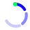

# GenLayer Spinner

An animated loading spinner designed for the GenLayer Portal, submitted to the
**"Design the GenLayer Spinner"** mission.


## Concept — "Consensus Ring"

GenLayer's core idea is validators reaching consensus. The spinner turns that
into motion instead of using a generic loading icon:

- **Three fading arcs** rotate continuously, like a validator signal decaying
  as newer confirmations arrive.
- **One leading green node** travels at the front of the ring — the
  "confirming validator" that has just settled.

## Brand compliance

Colors are taken directly from the official GenLayer brand kit
([genlayer.com/brand](https://genlayer.com/brand)):

| Role | Color | Hex |
|---|---|---|
| Ring / arcs | Kinetic Cobalt | `#110FFF` |
| Leading node | Success | `#00FF66` |

## Format

- Single self-contained `.svg` file — the CSS animation is embedded inside
  the `<style>` tag, so it works anywhere an ``, `<object>`, or inline
  SVG can be dropped in. No external CSS or JS required.
- Linear, constant-speed rotation (1.15s loop) for a smooth, professional
  spinner feel.
- Respects `prefers-reduced-motion` (falls back to a gentle pulse instead of
  spinning).
- Tested readable down to 16px, and works on both light and dark
  backgrounds since the shape has no background fill of its own.

## GenLayer Transaction Status Spinner (builder tool)

`genlayer-status-spinner.js` extends the visual spinner into a real builder
tool: it wires the ring directly to the live consensus status of an
Intelligent Contract transaction, using the official `genlayer-js` SDK.

- **Pending / Accepted** — validators are still reaching consensus → ring spins.
- **Finalized** — consensus reached → ring stops and turns Success green.
- **Undetermined** — validators could not agree → ring stops and turns Error red.

`status-demo.html` wires this to a **real deployed Intelligent Contract** —
[GoldPriceOracle](https://github.com/Mary1270/Genlayer-goldpriceoracle), a
multi-source gold price consensus contract live on GenLayer Studio
(`0x1763E5C8f4966D2d60e4774a348F46C50fF6AD72`). The demo tracks a real,
finalized `resolve_agreement` transaction
([0xf28c75...66e26d](https://explorer-studio.genlayer.com/tx/0xf28c75058b7ee5beed2a3a1225b53287e2a409916b4c1316dd87c8683f66e26d))
and reads its live status via `client.getTransaction` — nothing is mocked.

## Files

- `genlayer-spinner.svg` — the standalone decorative spinner, ready to embed.
- `genlayer-status-spinner.js` — builder tool: spinner driven by real GenLayer
  transaction status via `genlayer-js`.
- `status-demo.html` — live demo tracking a real transaction on the deployed
  GoldPriceOracle contract.
- `spinner_preview.gif` — animated preview on light and dark backgrounds
  (for reviewers; not required for use in the Portal).

## Usage

```html

```

or inline it directly in HTML/JSX for full control over sizing via CSS.
